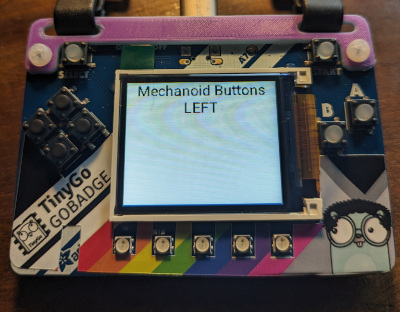
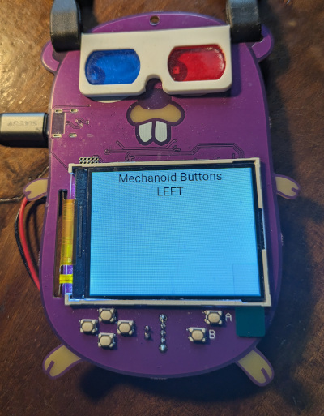

# Buttons

Application that loads an embedded WASM program and sends it events from pressing the buttons. The WASM programs then displays messages on the small screen on the hardware device.

### PyBadge



```bash
$ mecha flash -i wazero pybadge
Building module buttons
Done.
   code    data     bss |   flash     ram
    102       5   65531 |     107   65536
Application built. Now flashing...
   code    data     bss |   flash     ram
 342608   66300    7136 |  408908   73436
```

### Gopher Badge



```bash
$ mecha flash -i wazero gopher-badge
Building module buttons
Done.
   code    data     bss |   flash     ram
    102       5   65531 |     107   65536
Application built. Now flashing...
   code    data     bss |   flash     ram
 374480   66304    3656 |  440784   69960
```
