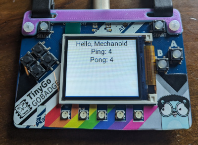

# Display



Application that loads an embedded WASM program and displays the interaction on the small screen on the hardware device.

## How it works

The application can connect to any of the displays supported in the `boards` package.

It then loads the `ping.wasm` program which is embedded into the application itself.

## How to run

### PyBadge

```
$ mecha flash -m -i wazero pybadge
Building module ping
Done.
   code    data     bss |   flash     ram
      9       0       0 |       9       0
Application built. Now flashing...
   code    data     bss |   flash     ram
 343236   66056    7128 |  409292   73184
Connected to /dev/ttyACM0. Press Ctrl-C to exit.
Mechanoid engine starting...
Adding display device...
Using interpreter wazero
Initializing engine...
Initializing interpreter...
Initializing devices...
Loading WASM module...
Running module...
Ping 1
Pong 1
Ping 2
Pong 2
Ping 3
Pong 3
...
```

### Gopher Badge

```
$ mecha flash -m -i wazero gopher-badge
Building module ping
Done.
   code    data     bss |   flash     ram
      9       0       0 |       9       0
Application built. Now flashing...
   code    data     bss |   flash     ram
 375100   66060    3664 |  441160   69724
Connected to /dev/ttyACM0. Press Ctrl-C to exit.
Mechanoid engine starting...
Adding display device...
Using interpreter wazero
Initializing engine...
Initializing interpreter...
Initializing devices...
Loading WASM module...
Running module...
Ping 1
Pong 1
Ping 2
Pong 2
Ping 3
Pong 3
...
...
```
