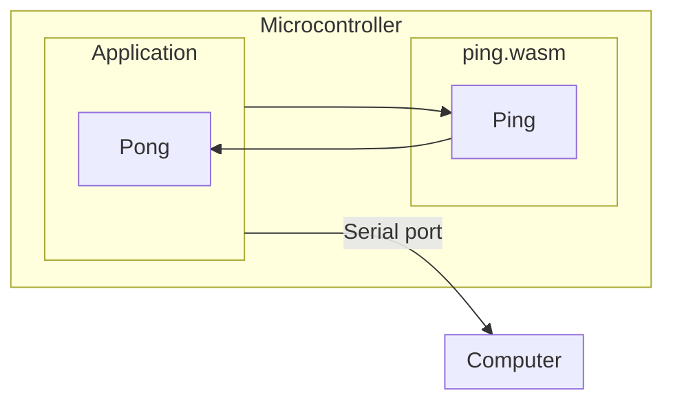

# Simple

Here is an example of a simple "ping" application built using Mechanoid.

It consists of a host application that runs on a microcontroller, and a separate WebAssembly module that will be run by the host application on that same microcontroller.

The host application loads the WASM and then executes it, sending the output to the serial interface on the board. This way we can see the output on your computer.

## How it works



## How to run it

### Build the WASM module

```
$ mecha build
Building module ping
   code    data     bss |   flash     ram
      9       0       0 |       9       0
```


### Flash the board

PyBadge:

```
$ mecha flash -m pybadge
   code    data     bss |   flash     ram
 101572    2044    6680 |  103616    8724
Connected to /dev/ttyACM0. Press Ctrl-C to exit.
Mechanoid engine starting...
Using interpreter wasman
Initializing engine...
Defining host function...
Loading WASM module...
Running module...
Calling ping...
pong
Calling ping...
pong
Calling ping...
pong
```

Gopher Badge:

```
$ mecha flash -m gopher-badge
   code    data     bss |   flash     ram
 109020    2044    3168 |  111064    5212
Connected to /dev/ttyACM0. Press Ctrl-C to exit.
Mechanoid engine starting...
Using interpreter wasman
Initializing engine...
Defining host function...
Loading WASM module...
Running module...
Calling ping...
pong
Calling ping...
pong
Calling ping...
pong
```

You should see output start in your terminal from the microcontroller.
