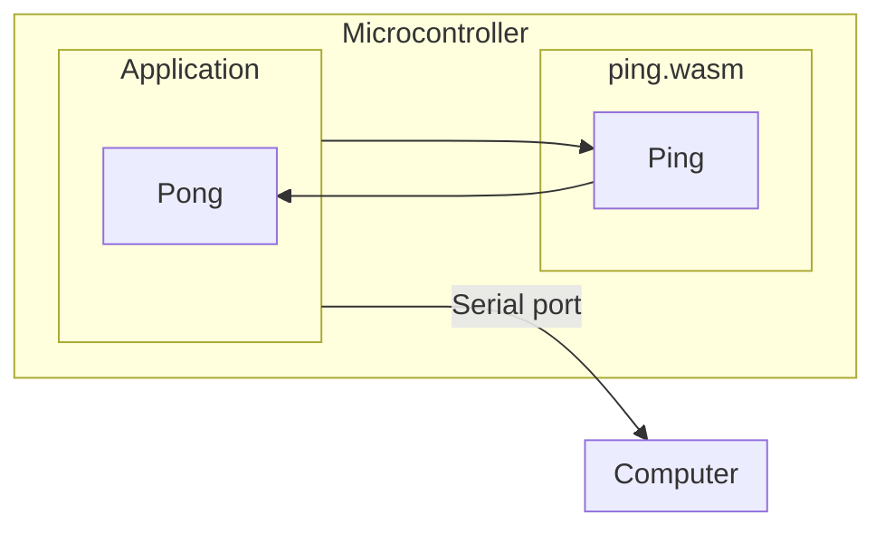

# Simple

Here is an example of an application built using Mechanoid.

It consists of a host application that runs on a microcontroller, and a separate WebAssembly module that will be run by the host application on that same microcontroller.

The host application loads the WASM and then executes it, sending the output to the serial interface on the board. This way we can see the output on your computer.

## How it works



## How to run it

### Compile the WASM module

See [ping module](../modules/ping/)

### Compile and flash the microcontroller

```
tinygo flash -size short -target pybadge -monitor ./simple
```

You should see output start in your terminal from the microcontroller.
