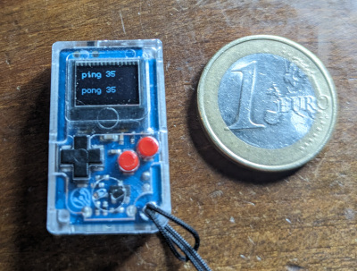
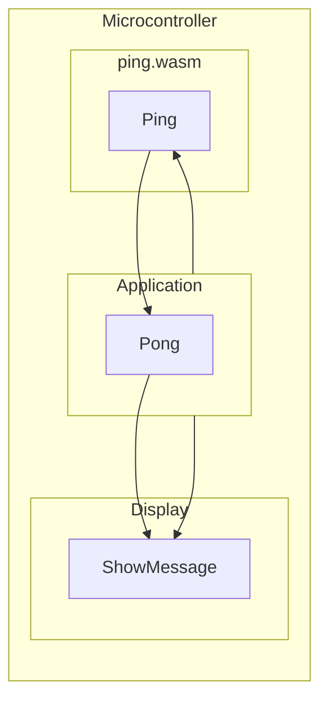

# Thumby

This is an example of an application built using Mechanoid specifically for the Thumby "itty-bitty game system". 

## How it works

```mermaid
flowchart LR
    subgraph Microcontroller
        subgraph Application
            Pong
        end
        subgraph ping.wasm
            Ping
        end
        subgraph Display
            ShowMessage
        end
        Ping-->Pong
        Application-->Ping
        Application-->ShowMessage
        Pong-->ShowMessage
    end
```
