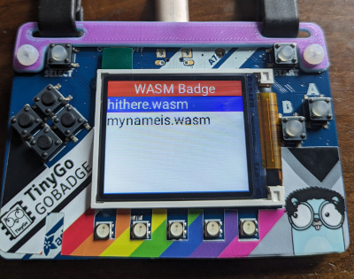
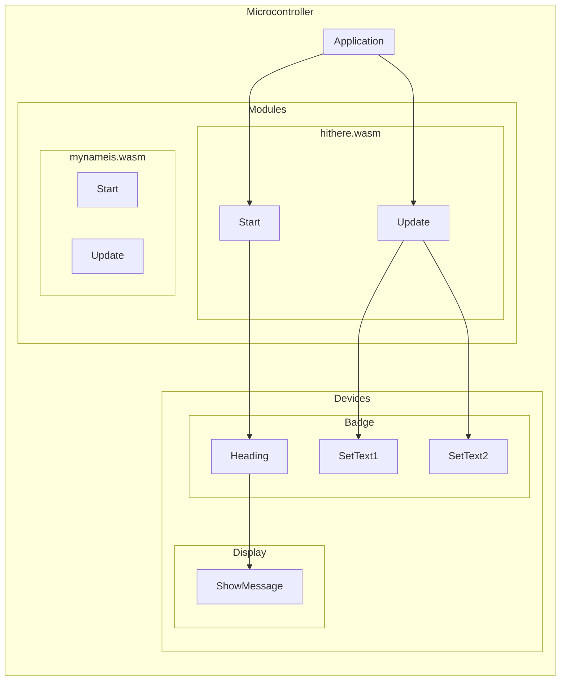

# WASMBadge



This application is a conference badge programmed using WASM.

## How it works



The application can connect to any of the display supported in the `boards` package.

It embeds all of the WASM files in the `modules` directory right into the application itself.

When the application runs, it presents a list of all of the different programs on the display.

Use the buttons to choose one of the programs, and then press the "A" button to run it.

If you want to cycle thru the entire list, press either the "START" button or the "B" button. The badge will run each of the WASM programs for 10 seconds before switching to the next one.

To get back to the home screen, press either the "SELECT" button or the "B" button.

## How to run

### PyBadge

```bash
$ mecha flash -i wasman pybadge
Building module hithere
Done.
   code    data     bss |   flash     ram
    461      31    4097 |     492    4128
Building module mynameis
Done.
   code    data     bss |   flash     ram
     93      32    4096 |     125    4128
Building module mythingis
Done.
   code    data     bss |   flash     ram
     38      62    4096 |     100    4158
Building module thisbadge
Done.
   code    data     bss |   flash     ram
     31      45    4096 |      76    4141
Building module youarehere
Done.
   code    data     bss |   flash     ram
     24      18    4096 |      42    4114
Application built. Now flashing...
   code    data     bss |   flash     ram
 133032    1748    6792 |  134780    8540
```

### Gopher Badge

```bash
$ mecha flash -i wasman gopher-badge
Building module hithere
Done.
   code    data     bss |   flash     ram
    461      31    4097 |     492    4128
Building module mynameis
Done.
   code    data     bss |   flash     ram
     93      32    4096 |     125    4128
Building module mythingis
Done.
   code    data     bss |   flash     ram
     38      62    4096 |     100    4158
Building module thisbadge
Done.
   code    data     bss |   flash     ram
     31      45    4096 |      76    4141
Building module youarehere
Done.
   code    data     bss |   flash     ram
     24      18    4096 |      42    4114
Application built. Now flashing...
   code    data     bss |   flash     ram
 143444    1752    3316 |  145196    5068
```

### Simulator

You need to install the Fyne cross-platform GUI toolkit to use the Mechanoid simulator.

https://github.com/fyne-io/fyne


```bash
$ mecha run -i wasman
Running using interpreter wasman
Building module hithere
Done.
   code    data     bss |   flash     ram
    461      31    4097 |     492    4128
Building module mynameis
Done.
   code    data     bss |   flash     ram
     93      32    4096 |     125    4128
Building module mythingis
Done.
   code    data     bss |   flash     ram
     38      55    4096 |      93    4151
Building module thisbadge
Done.
   code    data     bss |   flash     ram
     31      45    4096 |      76    4141
Building module youarehere
Done.
   code    data     bss |   flash     ram
     24      18    4096 |      42    4114
Mechanoid engine starting...
Initializing engine using interpreter wasman
Registering host modules...
...
```