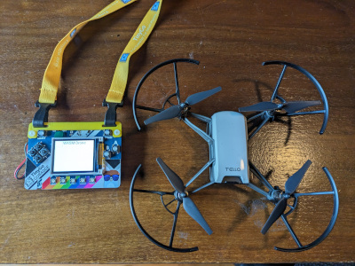
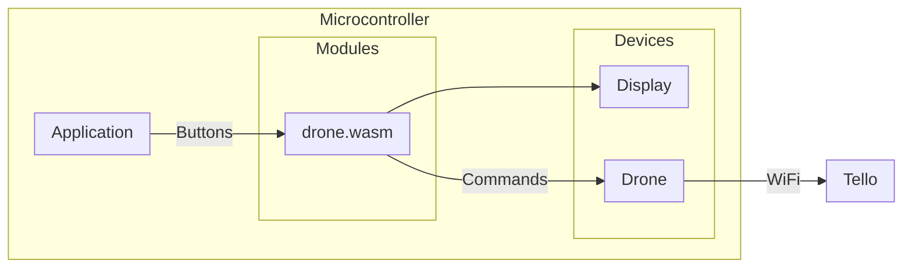

# WASMDrone



This application lets you write a WebAssembly program that runs on a hardware device with connected wireless to fly a DJI Tello drone.

You need a PyBadge with an AirLift WiFi or similar device to run this example.

## How it works

The application has 2 devices: the Display device for showing status, and the Drone device for communicating to the connected DJI Tello drone.



## How to run

### PyBadge

```
$ mecha flash -i wasman -m -params main.ssid=TELLO-XXXXXX pybadge
Building module drone
Done.
   code    data     bss |   flash     ram
    298      24    4096 |     322    4120
Application built. Now flashing...
   code    data     bss |   flash     ram
 164068    3960    6980 |  168028   10940
Connected to /dev/ttyACM0. Press Ctrl-C to exit.
Mechanoid engine starting...
Initializing engine using interpreter wasman
Registering host modules...

Tinygo ESP32 Wifi network device driver (WiFiNINA)

Driver version           : 0.27.0
ESP32 firmware version   : 1.7.4
MAC address              : a0:a3:b3:47:e5:dc

Connecting to Wifi SSID 'TELLO-XXXXXX'...FAILED (timed out)
Connecting to Wifi SSID 'TELLO-XXXXXX'...CONNECTED

DHCP-assigned IP         : 192.168.10.2
DHCP-assigned subnet     : 255.255.255.0
DHCP-assigned gateway    : 192.168.10.1

Registering host modules...
Loading and running WASM code...
Starting drone...
...
```

Now you can fly your drone around using your badge, thanks to the WASM code!
